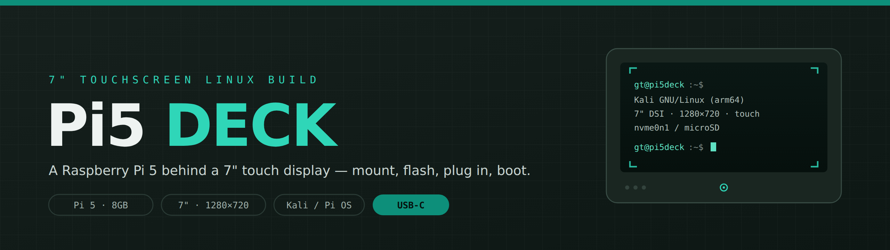
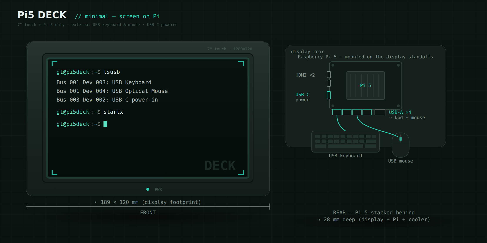

<div align="center">




**A Raspberry Pi 5 turned into a compact 7″ touchscreen Linux computer.**
Mount the Pi behind the display, flash an OS, plug in a USB keyboard and mouse, and boot.

[Build guide (PDF)](assets/Pi5-DECK-7inch-Build-Guide.pdf) · [Advanced handheld build](#advanced-build-the-handheld-cyberdeck)

</div>

---

The Pi 5 bolts to the official Touch Display 2's built-in standoffs and runs off USB-C — **no
battery, no soldering, no custom wiring.** This is the simplest way to build the deck.

> [!TIP]
> Want the full self-contained handheld instead — physical keyboard, internal battery, 3D-printed
> slab? That path is fully documented too. See [Advanced build](#advanced-build-the-handheld-cyberdeck).

<div align="center">

</div>

## At a glance

| | Spec |
|---|---|
| **Compute** | Raspberry Pi 5, 8GB (BCM2712, 4×A76 @ 2.4 GHz) |
| **Display** | Touch Display 2 — 7″ IPS, 720×1280 native, run **landscape 1280×720**, 5-pt touch (DSI) |
| **Input** | Any USB keyboard + mouse (plug-and-play) |
| **Power** | USB-C PD supply (official 27W recommended) |
| **Cooling** | Official Active Cooler — still required |
| **Storage** | microSD (simplest), or optional 1TB NVMe |
| **OS** | Kali Linux (Pi 5 ARM) or Raspberry Pi OS |
| **Footprint** | ~189 × 120 mm, ~28 mm deep with the Pi behind |

## What you need

| Required | Note |
|---|---|
| Raspberry Pi 5 (8GB) | BCM2712 board |
| Touch Display 2 (7″) | Buy a **current revision** |
| Active Cooler | Official Pi 5 cooler, or equivalent |
| microSD, 32GB | A2 / U3 |
| USB-C PD supply | Official 27W |
| USB keyboard + mouse | Any — plug-and-play |

The **DSI ribbon** and **GPIO power jumper** come with the display — nothing else to buy.

<details>
<summary><b>Optional add-ons</b></summary>

| Item | Adds |
|---|---|
| M.2 HAT+ + 1TB NVMe (2242) | Fast storage — see [below](#optional-fast-storage-nvme) |
| USB-C power bank / UPS HAT | Portability / internal battery |
| Case or stand | Protection / desk use |

</details>

## Build it

> [!WARNING]
> Buy a **current** Touch Display 2 revision — the Pi 5 can misread older revisions as a short and
> refuse to boot. And **active cooling is required** on a Pi 5; never run it without the cooler.

1. **Mount the Pi.** Screw the Pi 5 to the display's M2.5 standoffs (58 × 49 mm). Seat the **22-pin
   DSI ribbon** into **DSI1**, and connect the included jumper: **5V → GPIO pin 2**, **GND → pin 6**.
2. **Fit the cooler.** Attach the Active Cooler and plug its fan into the 4-pin fan header.
3. **Flash the OS.** Use Raspberry Pi Imager to write Kali (Pi 5 ARM) or Raspberry Pi OS to the
   microSD; set hostname, user, SSH, and Wi-Fi in advanced options.
4. **First boot & configure.**
   ```bash
   sudo apt update && sudo apt full-upgrade -y
   wlr-randr --output DSI-1 --transform 90   # landscape (Wayland)
   ```
   Then add to `/boot/firmware/config.txt`:
   ```
   usb_max_current_enable=1
   ```
5. **Plug in peripherals.** Connect the USB keyboard and mouse to any USB-A port. Plug-and-play,
   no drivers. Touch is handled by libinput.

## Verify

- [ ] Boots to desktop/console on the 7″ panel, in landscape
- [ ] Touch tracks correctly (recalibrate if offset)
- [ ] Keyboard and mouse both work
- [ ] Thermals healthy under load:

```bash
vcgencmd measure_temp        # SoC temperature
vcgencmd get_throttled       # 0x0 = healthy
```

> [!NOTE]
> All four boxes ticked? You have a working 7″ Pi5 DECK.

## Optional: fast storage (NVMe)

Add the official M.2 HAT+ and a 1TB **2242** NVMe, then migrate the OS off the microSD with
`nvme-migrate.sh` — run it on the Pi as root. It clones the live system and sets the bootloader to
prefer NVMe (it pauses for a `YES` confirmation, since it erases the target).

```bash
chmod +x nvme-migrate.sh
sudo ./nvme-migrate.sh
findmnt /                    # after reboot: should show /dev/nvme0n1p2
```

## Advanced build: the handheld cyberdeck

<details>
<summary>Build the full self-contained handheld — physical keyboard, internal 4× 21700 battery, NVMe, 3D-printed slab.</summary>

<br/>

| Document | Purpose |
|---|---|
| `Pi5-Handheld-Terminal-Blueprint.md` | Full blueprint + shopping list — start here |
| `Pi5-Deck-Wiring.md` | Wiring: UPS HAT, display, I2C, cooler, charging |
| `Pi5-Deck-CAD-Handoff.md` | Dimensioned enclosure / CAD handoff |
| `Pi5-DECK-Build-Guide.pdf` | Full illustrated build guide |
| `nvme-migrate.sh` | SD → NVMe migration (used by both builds) |

> [!CAUTION]
> The handheld path involves **lithium-ion cells** and GPIO wiring. Read the safety notes in the
> blueprint and wiring docs before sourcing parts or applying power.

</details>

## Software notes

- **Kali** Pi 5 ARM image suits security-research use and the DSI panel is driver-free on it;
  **Raspberry Pi OS** is the lighter general-purpose option.
- Confirm `vcgencmd get_throttled` stays `0x0` under load.

## License

MIT © 2026 Greg — see [`LICENSE`](LICENSE).
